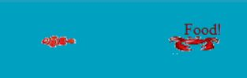

Feeding Frenzy Version 1.0 by Bardia Parmoun

Released on: 30/05/2018

______________________________________________________________________________________

DESCRIPTION
______________________________________________________________________________________
The goal of this game is to get keep eating smaller fishes and get larger while
aviding the large enemies.

INSTALLING UNDER WINDOWS 10
______________________________________________________________________________________
This program was created with the Turing language. All you need to run this game is 
to install the turing language:

You can install turing using this link:
https://turing.software.informer.com/4.1/
______________________________________________________________________________________
 
USAGE
______________________________________________________________________________________
At first you start with a small fish where you can only eat shrimps. After eating those
shrimps you get larger and have the ability to eat other fishes.\

If you get close to the enemies they will follow you!

  

There is an option for you to get a boost to get faster and running from the enemies.
This can be achieved by eating the rockets

  

  

Once you level up you enter the darker parts of the ocean and have the option of eating
larger fishes.

  

______________________________________________________________________________________

CREDITS
______________________________________________________________________________________
Author: Bardia Parmoun

______________________________________________________________________________________

LICENSE
______________________________________________________________________________________
MIT License

Copyright (c) [2018] [Bardia Parmoun]

Permission is hereby granted, free of charge, to any person obtaining a copy
of this software and associated documentation files (the "Software"), to deal
in the Software without restriction, including without limitation the rights
to use, copy, modify, merge, publish, distribute, sublicense, and/or sell
copies of the Software, and to permit persons to whom the Software is
furnished to do so, subject to the following conditions:

The above copyright notice and this permission notice shall be included in all
copies or substantial portions of the Software.

THE SOFTWARE IS PROVIDED "AS IS", WITHOUT WARRANTY OF ANY KIND, EXPRESS OR
IMPLIED, INCLUDING BUT NOT LIMITED TO THE WARRANTIES OF MERCHANTABILITY,
FITNESS FOR A PARTICULAR PURPOSE AND NONINFRINGEMENT. IN NO EVENT SHALL THE
AUTHORS OR COPYRIGHT HOLDERS BE LIABLE FOR ANY CLAIM, DAMAGES OR OTHER
LIABILITY, WHETHER IN AN ACTION OF CONTRACT, TORT OR OTHERWISE, ARISING FROM,
OUT OF OR IN CONNECTION WITH THE SOFTWARE OR THE USE OR OTHER DEALINGS IN THE
SOFTWARE.